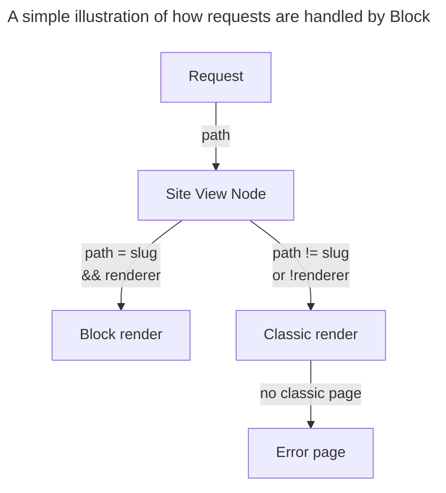
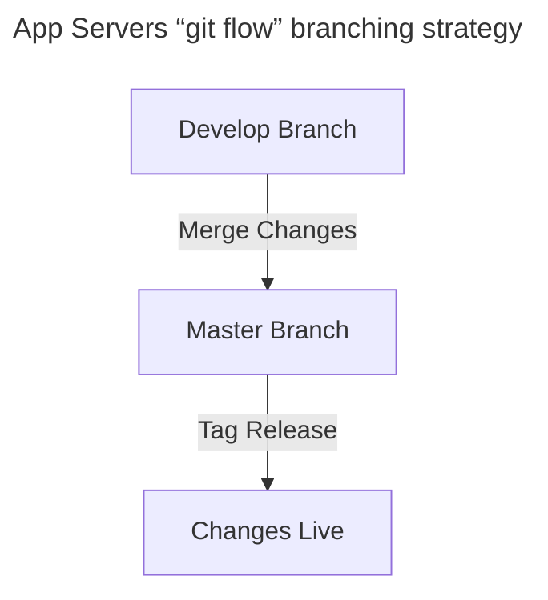
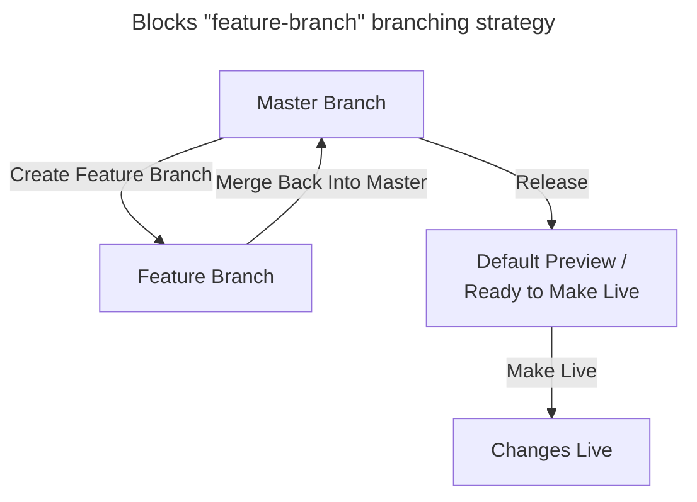

# Blocks

This guide provides an overview of Blocks in Contensis, covering setup and deployment for apps using Contensis React Base (CRB) 3.x.x or higher.

Key topics include CI/CD configuration, token setup, Docker integration, routing, and rendering. It also explains workflows for branching, previewing, and releasing Blocks, with a focus on streamlining deployment and maintenance. 

## Supported Versions

Blocks are supported by apps running Contensis React Base >3.x.x, however we always recommend ensuring you’re on the latest version of Contensis React Base.

We recommend ensuring that `zengenti-buildstartup-package` is on version `0.0.16` as a minimum for Blocks.

## Config

In a GitLab-hosted project, Block CI/CD is configured using the **`gitlab-ci.yml`** file. This file typically defines three stages: **build**, **push**, and **release**.

- **Build:** Compiles the Docker image.
- **Push:** Uploads the Docker image to Blocks.
- **Release:** Tags the build with a release tag.

### Required Tokens

A Block configuration requires three essential tokens for proper functionality:

1. **GITLAB_ACCESS_TOKEN**
2. **CONTENSIS_CLIENT_ID**
3. **CONTENSIS_SHARED_SECRET**

### GitLab Access Token

To create an access token in GitLab:

1. Go to your repository’s **Settings → Access Token**.
2. Create a new token with the **`api`** and **`read_repository`** scopes.

### Contensis Tokens

These tokens are Management API keys, which require appropriate roles within your Contensis environment:

1. Navigate to **Settings → API Keys** in Contensis and create a new API key.
2. Go to **Settings → Roles**, and create a new role with the **Blocks** permission type set to **All Actions.**
3. In the Role’s **API Keys** tab, assign your newly created API key to this role.

### Adding Tokens to CI/CD Variables

To keep these tokens secure and prevent them from being exposed during builds, you must configure them as CI/CD variables in GitLab:

1. Go to your repository’s **Settings → CI/CD → Variables.**
2. Add each token using its corresponding variable name from the configuration file (e.g., **`CONTENSIS_CLIENT_ID`**).
3. Mark **CONTENSIS_SHARED_SECRET** and **GITLAB_ACCESS_TOKEN** as **masked** to hide their values during pipeline execution.

## Docker

The Docker build of your project must include a copy of the `manifest.json` file. This can be achieved by utilising a COPY command in your Docker build.

```shell title="In a React Starter based project you will need to add the COPY command before the ENTRYPOINT in the ci-build.dockerFile"
# Add this COPY command before ENTRYPOINT
COPY ./manifest.json /manifest.json
ENTRYPOINT node ...
```

## Renderers

Renderers dictate which content should be rendered by the Block. Whenever a new Block is created an associated Renderer will be created for that Block. Once created, Renderers can be assigned to Content Types or to Site View Nodes. 

See: https://www.contensis.com/help-and-docs/guides/deploying-websites-and-apps/renderers/renderers-overview

### Settings

To change the Renderer controls you can navigate to **Settings → Renderers → Block Name.**

### Content Type Rendering

From the Renderer settings panel you can define which Content Types a Block should render. Individual Content Types can be chosen or all of them.

### Site View Rendering

From the Site View panel you can define which Renderer a Block should use for each node.

You can also enable to **“Is partial match root?”** which will catch all routes underneath the current node (e.g. `/events` has partial match root enabled so `/events/my-event` will resolve).

:::danger
It is **not** recommended to enable **Is partial match root?** on the Root Node in Site View.
:::

## Routing

Routing at the Block level is handled by the request handler. The request handler follows the following pattern:



:::info
This routing structure can be beneficial if you're still migrating from Classic Contensis to Content Types and Entries. When the Block's request handler does not find a suitable node in the Site View tree it will fallback to a Classic URL. This can enable you to more easily migrate your website section by section from Classic to CT&E.
:::


### Content Type Routes

This pattern means that Content Type routes will always resolve to the Block so long as they are assigned a Renderer, see [Content Type Rendering](/react-starter/deployment/blocks#content-type-rendering). 

### Static Routes

For Static Routes however you will have to ensure the corresponding Site View node has the correct renderer assigned, see [Site View Rendering](/react-starter/deployment/blocks#site-view-rendering).

### Server Features

Some features, like the sitemap in our Starter project, will require a node with an assigned renderer just like a Static Route.

## Manifest

The `manifest.json` file, normally located at the root of a project, allows some control of how the Block operates.

| **Parameter** | **Type** | **Default** | **Description** |
| --- | --- | --- | --- |
| `port` | `number` | `3001` | Allows you define a custom port |
| `static_paths` | `string[]` | `[’static’, ‘image-library’]` | Allows you to add additional static paths. The default values will be retained. |
| `enableFullUriRouting` | `boolean` | `false` | See [Full URI Routing](/react-starter/deployment/blocks#full-uri-routing)  |

### Full URI Routing

This will be set to `true` for any CRB based project. This means the Block will use it’s own routing to handle the absolute path of the current page. For example, if the original request is, [*https://www.website.com/a/specific/path](https://www.website.com/a/specific/path),* then the Block will receive this request, http://10.34.65.87/a/specific/path?nodeId=xxx&entryId=yyy.

If the value is `false` for the same request the block will receive this request http://10.34.65.87/?originPath=/a/specific/path&nodeId=xxx&entryId=yyy

## Assets

All content served by a Block is rendered via the request handler service. The service will parse the Block response and look for asset URLs defined in the `manifest.json`.

### IIS / Classic Assets

With Blocks you no longer have to define Reverse Proxy paths (`REVERSE_PROXY_PATHS`) for assets in production as assets are resolved through the Block. You may still have to define reverse proxy paths for assets in local development however. 

### Static Assets

Static Assets should be handled automatically in a CRB app since `static` is a default static path within the [Manifest](/react-starter/deployment/blocks#manifest).

## Branching and Previewing

### Branches

Each Block has one designated protected branch, typically named **master** or **main**, used exclusively for deploying changes to the live URL.

While Blocks support multiple branches simultaneously, only three branches (in addition to the protected branch) can be active at any given time. These are referred to as “active” branches, and their status is determined by the most recent commit activity.

When a new branch is created or an update is pushed to an older, inactive branch, the Block automatically adjusts by stopping one of the current active branches to make room for the newly updated branch. The updated branch is promoted to active status, while the replaced branch transitions to a “stopped” state.

Stopped branches remain accessible and can be restarted manually via the UI or reactivated automatically by pushing a new commit to them.

:::info
Pushing a fresh commit to a branch is the best way to ensure that branch remains available for preview as that branch will become one of the 3 active feature branches.

In comparison, restarting a stopped branch but not committing to that branch only makes that branch available temporarily.
:::

### Moving from App Server branching to Blocks

The old App Server structure facilitated a simplified “git flow” branching strategy where code was developed in the `develop` branch and then merged to `master` ready to make live through a `release` tag. At each stage a container was available to preview the code through the `preview.` and `live.` domains.



Blocks have been designed to facilitate a more complete implementation of the “git flow” branching strategy. Due to this you will likely have to adapt your branching strategy to ensure the necessary previews are available. 

Master is typically your live production branch and is still protected behind both a “release” mechanism and a “make live” mechanism.



### Previewing

When previewing content rendered via a Block, the default view will always display your live branch and the most recent commit that has been **Made Live** or **Released.**

For all other previewing scenarios, you will need to use the **sharing URL** provided by the Block Toolbar. The toolbar, visible on any Block preview, allows you to select a specific branch and/or commit to preview. Once you’ve selected a version, you can share the preview with others by using the sharing URL available in the toolbar.

### Why use the sharing URL?

Block previews rely on cookies to determine which branch and version to display. The sharing URL ensures that the correct preview is shown to others by appending specific query parameters to the URL. These parameters are processed by the request handler to render the appropriate Block preview, providing a consistent experience for all users accessing the shared preview.

See: https://www.contensis.com/help-and-docs/guides/deploying-websites-and-apps/blocks/preview-a-block

## Releasing

Compared to the old App Server setup Blocks have two different release mechanisms; release and make live.

**Release** marks the Block version as being available and ready for production use. This can be fully automated from your continuous integration build or actioned as a manual process in the UI.

See: https://www.contensis.com/help-and-docs/guides/deploying-websites-and-apps/blocks/releasing-a-block

**Make Live** switches your production code to use the new Block and takes the old Block offline. The switch is immediate, and the new Block will serve all web traffic that was previously served by the old Block. This mechanism replaces the old release tagging mechanism from app server deployments.

See: https://www.contensis.com/help-and-docs/guides/deploying-websites-and-apps/blocks/make-a-block-live

## Requesting Specific Blocks

If for some reason you need to request a specific branch and/or version of a Block you can do so by making requests that include a cookie to inform the request handler which Block you’re trying to access. Here’s an example of a curl request:

```shell title="An example curl request for a specific branch/version from a Block preview URL"
## Update the following parameters to suit your request
## BLOCK-NAME, BRANCH-NAME, VERSION, ALIAS
## An easy way to get the correct cookie is to preview your desired Block in the browser and copy the cookie value from dev tools

curl -v --cookie "x-block-config=BLOCK-NAME-branch%3DBRANCH-NAME%26BLOCK-NAME-versionno%3DVERSION" https://preview-ALIAS.cloud.contensis.com/
```

## Further Reading

### Block Statuses

To understand Block statues such as “Started”, “Running”, or “Available”, see: https://www.contensis.com/help-and-docs/guides/deploying-websites-and-apps/blocks/understanding-block-status

### Mark as Broken

To understand what “Mark as broken” does see: https://www.contensis.com/help-and-docs/guides/deploying-websites-and-apps/blocks/mark-a-block-as-broken

### Rollback

To rollback a Block see: https://www.contensis.com/help-and-docs/guides/deploying-websites-and-apps/blocks/rollback-to-a-previous-block-version

### Console Logs

To see the console logs for a Block see: https://www.contensis.com/help-and-docs/guides/deploying-websites-and-apps/blocks/view-the-console-logs-for-a-block

## Help Guides

### Blocks

Blocks: https://www.contensis.com/help-and-docs/guides/deploying-websites-and-apps/blocks/view-and-filter-blocks

### Renderers
 
Renderers: https://www.contensis.com/help-and-docs/guides/deploying-websites-and-apps/renderers/renderers-overview